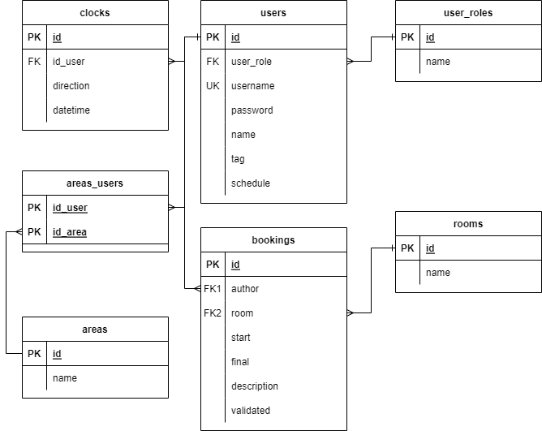

# setr13backend - SETR - IPCA
Trabalho realizado para a disciplina de Sistemas Embebidos e em Tempo Real

## Objetivo
Construir uma Web Api para o registo de entradas e saídas dos trabalhadores da empresa, assim como o autorizar o seu acesso a certas áreas da empresa e reserva de salas de reunião.

## Diagrama de Entidade-Relação
O projeto é executado com o apoio de um servidor de PostgreSQL, com a seguinte estrutura:

## Controlo de Versão
### Versão 1.0
- Startup e configurações iniciais

### Versão 2.0
- Configuração do middleware de erros
- Configuração do Knex
- Estruturação dos controladores e rotas
- Definição do controlador das salas, áreas e marcação de ponto

### Versão 2.1
- Alterações na base de dados